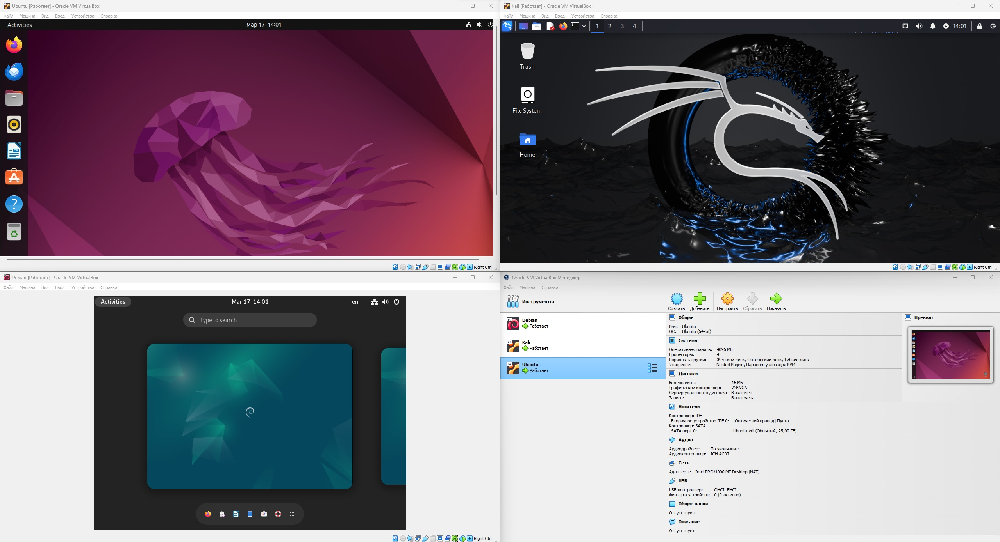

### Ubuntu  
**- Целевое назначение** 

Версия Ubuntu LTS (Long Term Support) является самой стабильной и надежной из всех. Она предлагает длительную поддержку, включая обновления безопасности и исправления ошибок на протяжении пяти лет после выпуска. Это идеальный выбор для серверов и корпоративных окружений, где стабильность и надежность критически важны.

**- Распространение пакетов** 

После развертывания агентов для Linux можно начать распространять ПО на эти устройства Linux. Процедура первоначального развертывания агентов Linux использует подключение SSH. После установки агентов главный сервер начинает использовать стандартного агента Ivanti для взаимодействия с сервером Linux и передачи файлов. Для распространения ПО на устройство Linux необходимо иметь административные права.

На устройства Linux можно отправлять только модули RPM. Агенты Linux автоматически установят каждый из отправленных вами модулей RPM. Сам модуль RPM не хранится на сервере после установки. Вы можете установить и удалить модуль RPM с помощью функции распространения ПО. Для распространения ПО для Linux можно использовать только методы принудительной доставки. Во время распространения ПО для Linux настройки принудительной доставки игнорируются, поэтому неважно какой метод доставки и какие его параметры были выбраны.

Процесс распространения таков:

1. Главный сервер подключается к устройству Linux посредством стандартного агента Ivanti.
2. Устройство загружает пакет.
3. Устройство запускает сценарий оболочки, который использует команды установки пакета RPM.
4. Устройство отправляет на главный сервер информацию о состоянии процесса.

Вы можете хранить модули RPM для Linux на общих HTTP-ресурсах. Распространение ПО для Linux не поддерживает совместное использование файлов с UNC-именами . Используя общие ресурсы HTTP обязательно активизируйте функцию обзора каталогов для этих ресурсов. Если общий ресурс HTTP находится на устройстве Windows, отличном от главного сервера, на нем нужно сконфигурировать службу IIS с поддержкой типа MIME для файлов RPM. В противном случае тип MIME по умолчанию, который используется службой IIS, вызовет ошибку загрузки файла RPM.

**- Набор функций** 

Различные версии Ubuntu могут быть оптимизированы для определенных задач. Например, Ubuntu Studio предназначена для творческой работы, включая звукозапись, графический дизайн и видеомонтаж. Если вам нужна операционная система для разработки приложений, то вам лучше подходит Ubuntu Developer Edition. Если вы просто хотите использовать Ubuntu в качестве домашней ОС, то основная версия Ubuntu Desktop будет оптимальным выбором.

**- Пользовательский интерфейс** 

Широкий выбор программ и инструментов для работы и развлечений. Ubuntu Desktop имеет простой и интуитивно понятный интерфейс, который делает его доступным даже для новичков в мире Linux.

- LTS-версии (Long Term Support) разрабатываются в течение более длительного периода времени и поддерживаются в течение 5 лет после выпуска.
- LTS-версии подходят для более консервативных пользователей, предпочитающих стабильность и надежность.
- Они рекомендуются для бизнес-пользователей, серверных сред и тех, кто предпочитает долговременную поддержку и доверие.
- Новые функции и обновления в LTS-версиях вводятся с большой осторожностью и минимизируются прерываниями.

В общем, выбор между LTS и обычной версией Ubuntu зависит от ваших потребностей и предпочтений. Если вам нужна ведущая роль в инновациях и последних версиях программного обеспечения, выбирайте обычную версию. Если же вам важна стабильность и длительная поддержка, то предпочтительнее выбирать LTS-версию.

**- Сообщество поддержки** 

Одним из важных аспектов при выборе версии операционной системы Ubuntu является поддержка и обновления. Поддержка и регулярные обновления являются неотъемлемой частью работы с любой операционной системой, и Ubuntu в этом плане не является исключением.

Поддержка Ubuntu осуществляется в двух основных ветвях:

- Долгосрочная поддержка (LTS) — эти версии выпускаются каждые два года и предоставляют поддержку в течение пяти лет на рабочих станциях и серверах. Это означает, что вы будете получать обновления безопасности и исправления ошибок в течение длительного периода времени, что делает LTS идеальным выбором для бизнес-критических систем или тех, кто хочет долго пользоваться одной версией ОС.
- Обычные релизы — это версии, которые выпускаются каждые шесть месяцев и предлагают поддержку в течение девяти месяцев. Эти версии предлагают более свежие версии программного обеспечения и могут быть интересны для пользователей, которым важны последние обновления и функции.

### Debian  
**- Целевое назначение** 

**Debian является свободным ПО.** 
Debian создан из свободного ПО и ПО с открытым исходным кодом и всегда будет на 100% свободным. Система свободная для всех для использования, изменения и распространения. Это наше основное обещание нашим пользователям. И ещё система бесплатна. 

**Debian является стабильной и безопасной операционной системой на основе Linux.** 
Debian — операционная система для широкого круга устройств, включающего ноутбуки, настольные компьютеры и серверы. Пользователям нравится её стабильность и надёжность начиная с 1993 года. Мы предоставляем разумные настройки по умолчанию для каждого пакета. Разработчики Debian по возможности предоставляют обновления безопасности для всех пакетов в течение их жизненного цикла.

**Debian имеет широкую поддержку оборудования.** 
Большая часть оборудования уже поддерживается ядром Linux. Если недостаточно свободного ПО, то для оборудования доступны проприетарные драйверы.

**Debian предоставляет плавные обновления.** 
Система Debian хорошо известна за её простые и плавные обновления в ходе жизненного цикла выпуска, а также при переходе на новый крупный выпуск.

**Debian является началом и основой для множества других дистрибутивов.** 
Множество наиболее популярных дистрибутивов Linux, таких как Ubuntu, Knoppix, PureOS, SteamOS или Tails, выбрали Debian в качестве основы для их ПО. Debian предоставляет все инструменты, поэтому всякий может расширить ПО из архива Debian, добавив свои собственные пакеты для своих нужд.

**Проект Debian — это сообщество.** 
Debian — это не только операционная система на основе Linux. ПО совместно создаётся сотнями добровольцев со всего мира. Вы можете стать частью сообщества Debian, даже если вы не являетесь программистом или системным администратором. Debian является сообществом, управляется благодаря договорённостям и имеет демократическую структуру. Поскольку все разработчики Debian обладают равными правами, сообщество не может контролироваться какой-то одной компанией. Наши разработчики живут более чем в 60 странах, а программа установки содержит переводы на более чем 80 языков.

**Debian имеет множество возможностей установки.** 
Конечные пользователи используют наш живой CD-образ, включающий простую в использовании программу установки Calamares, для использования которой требуется совсем немного знаний. Более опытные пользователи могут использовать нашу уникальную полнофункциональную программу установки, а эксперты могут настроить установку под свои нужды или даже использовать автоматизированный инструмент сетевой установки.

**- Распространение пакетов** 

Debian имеет наибольшее число доступных для установки пакетов (в настоящее время — 59000). Наши пакеты используют формат deb, который хорошо известен своим высоким качеством.

Официальные образы для облачных систем доступны для всех основных облачных платформ. Также мы предоставляем инструменты и настройки, чтобы вы могли собрать собственный образ для облачных систем. Также вы можете использовать Debian в виртуальных машинах на настольных компьютерах или в контейнерах.

**- Набор функций** 

Вот ключевые возможности, отличающие Debian от других дистрибутивов Linux:

**Свобода** 
Как заявлено в общественном договоре, Debian всегда будет свободным на 100%. В Debian распространяется только действительно свободное программное обеспечение. Такое ПО должно отвечать критериям Debian по определению свободного ПО.

**Система управления пакетами Debian** 
Система в целом или любая её часть может быть обновлена без переформатирования, без потери пользовательских настроек и (в большинстве случаев) без перезагрузки системы. В большинстве современных дистрибутивов Linux тоже есть свои системы управления пакетами; система управления пакетами Debian уникальна и хорошо продумана (см. Глава 7, Основы системы управления пакетами Debian).

**Открытая модель разработки** 
Многие дистрибутивы Linux разрабатываются индивидами, небольшими закрытыми группами, либо коммерческими компаниями. Debian же представляет собой крупный дистрибутив Linux, который разрабатывается объединением индивидов, общей целью которых является создание свободной операционной системы в духе Linux и другого свободного ПО.

Более 1012 сопровождающих, действующих по собственной инициативе, работают над более чем 59100 пакетами и улучшением Debian GNU/Linux. В большинстве случаев разработчики Debian помогают проекту не написанием новых приложений, а пакетированием существующего ПО в соответствии со стандартами проекта, отправкой сообщений о найденных ошибках разработчикам программ и предоставлением поддержки пользователям. О том, как стать таким сотрудником, см. Глава 13, Помощь проекту Debian.

**Универсальная операционная система** 
Debian поставляется с более чем 59100 пакетами и работает на 9 архитектурах. Это намного больше, чем доступно в любом другом дистрибутиве GNU/Linux.

**Система отслеживания ошибок** 
В связи с территориальной рассредоточенностью разработчиков Debian для ускорения разработки системы и быстрого исправления ошибок им требуется подходящий инструментарий. Пользователи присылают сообщения об обнаруженных ошибках в специальном формате, которые становятся доступны через WWW-архивы и электронную почту. Для дополнительной информации о ведении журнала ошибок см. Раздел 12.4, «Существуют ли журналы известных ошибок?».

**Политика Debian** 
В Debian есть всестороннее описание стандартов качества — политика Debian (Debian Policy). Этот документ определяет качества и стандарты, согласно которым мы разрабатываем пакеты Debian.

**- Пользовательский интерфейс** 

Программа установки Debian поддерживает несколько пользовательских интерфейсов для задания вопросов
с различной степенью удобства управления: в частности, в text используется простой текст, в newt используется текстовые псевдографические окна

**- Сообщество поддержки** 

debian-user in Russian
Support for Debian users that speak Russian.
For Russian localization work, see debian-l10n-russian.

https://lists.debian.org/debian-l10n-russian/

Language used on this list: Russian.

This list is not moderated; posting is allowed by anyone.

Posting address: debian-russian@lists.debian.org

### Kali  
**- Целевое назначение** 

Kali Linux является готовым дистрибутивом аудита безопасности Linux, который основан на Debian GNU/Linux. Целевой аудиторией Kali являются профессионалы в сфере безопасности и IT администраторы, что позволяет им проводить тестирование на проникновение, криминалистический анализ и контроль безопасности.

Дистрибутив Kali Linux основан на Debian Testing. Именно поэтому большинство пакетов, доступных в Kali Linux, пришли прямо из репозитория Debian. Несмотря на то, что в основном Kali Linux полагается на Debian, он является полностью независимым в смысле того, что у нас есть своя собственная инфраструктура, и в связи с этим мы сохраняем полную свободу производить любые изменения, какие мы захотим.

**- Распространение пакетов** 

Со стороны Debian, специалисты ежедневно работают над обновлением пакетов и загрузкой их в дистрибутив Debian Unstable. Как только самые проблемные ошибки будут устранены, пакеты переносятся в дистрибутив Debian Testing. Процесс переноса также гарантирует, что ни одна из зависимостей не будет нарушена в Debian Testing. Основная задача подобного рода действий заключается в том, что Testing всегда готов к использованию (или даже к новому выпуску!)

Цели, преследуемые Debian Testing, полностью совпадают с задачами, поставленными перед Kali Linux, и именно поэтому мы взяли его за основу. Чтобы добавить в дистрибутив специальные Kali пакеты, мы следуем процессу, состоящему из двух этапов.

Сначала, мы берем Debian Testing и принудительно внедряем наши собственные пакеты Kali (расположенные в нашем репозитории kali-dev-only) для создания репозитория kali-dev. Этот репозиторий время от времени будет давать сбои: например, наши специальные Kali пакеты, могут не устанавливаться, пока они не будут перекомпилированы в отношении более новых библиотек. В других ситуациях раздвоенные пакеты, также могут быть обновлены, чтобы снова стать инсталлируемыми или для того, чтобы исправить инсталлируемость другого пакета, который зависит от более новой версии раздвоенного пакета. В любом случае, kali-dev не предназначен для конечных пользователей.

kali-rolling является дистрибутивом, информацию о котором пользователи Kali Linux скорее всего будут отслеживать. Также он создан из kali-dev таким же образом, как и Debian Testing создан из Debian Unstable. Пакеты переносятся только тогда, когда все зависимости могут быть удовлетворены в целевом дистрибутиве.

**- Набор функций** 

**Metasploit framework** 
Инструмент для создания, тестирования и использования эксплойтов. Позволяет конструировать эксплойты с необходимой в конкретном случае «полезной нагрузкой» (payloads), которая выполняется в случае удачной атаки, например, установка shell или VNC сервера. Также фреймворк позволяет шифровать шеллкод, что может скрыть факт атаки от IDS или IPS.

**Nmap (Network Mapper)** 
Это свободная утилита, предназначенная для настраиваемого сканирования IP-сетей с любым количеством объектов, определения состояния объектов сканируемой сети (портов и соответствующих им служб). Nmap обычно используется для аудита безопасности, многие системные и сетевые администраторы находят это полезным для повседневной работы такие задачи, как инвентаризация сети, управление обновлением услуг расписания и мониторинг работоспособности хоста или службы.

**Wifite** 
Это автоматизированный инструмент для атак на беспроводную сеть. Работает с привязкой wifi адаптер. Не все поддерживает адаптеры к kali, нужно выбрать с умом. Вот самые популярные адаптеры:

**Sqlmap** 
Sqlmap — это инструмент тестирования на проникновение с открытым
исходным кодом, который автоматизирует процесс обнаружения и
использования ошибок SQL-инъекций и захвата серверов баз данных. Он
поставляется с мощным механизмом обнаружения, множеством
специализированных функций для идеального тестера на проникновение и
широким набором переключателей, начиная от снятия отпечатков пальцев с
базой данных, выборки данных из базы данных и заканчивая доступом к
базовой файловой системе и выполнению команд в операционной системе
через внешний интерфейс. внеполосные соединения.

**John The Ripper** 
John The Ripper - это инструмент с открытым исходным кодом для взлома
паролей методом перебора. Изначально он был разработан для Unix, но
сейчас доступен на всех Unix-подобных платформах, в том числе и Linux.
Программа также известна как JTR или John. Она наиболее часто
используется для перебора паролей по словарю.

Программа берет текстовую строку из файла, шифрует его таким же образом, как был зашифрован пароль, а затем сравнивает зашифрованный пароль и полученную строку. Если строки совпадают, вы получаете пароль, если нет, программа берет другую строку из текстового файла (словаря). Именно с помощью этого инструмента можно проверить насколько надежны пароли в вашей системе.

**Burp Suite** 
Burp Suite - это инструмент для поиска уязвимостей на сайтах интернета и
в веб-приложениях, который может работать как по HTTP, так и по HTTPS.
Он используется многими специалистами для поиска ошибок и тестирования
веб-приложений на проникновение. Программа позволяет объединить ручные
методы со своими средствами автоматизации, чтобы выполнить тестирование
как можно эффективнее. Burp Suite написана на Java и распространяется в формате Jar.

**Nikto** 
Nikto — это подключаемый веб-сервер и сканер CGI, написанный на Perl с использованием
LibWhisker RFP для выполнения быстрых проверок безопасности или информации.

**- Пользовательский интерфейс** 
Команда разработчиков Kali Linux представила графический интерфейс для подсистемы Windows для Linux (WSL). Решение называется Win-Kex (Windows + Kali Desktop EXperience). Теперь можно запускать популярный дистрибутив для пентеста на ПК с Windows 10 в WSL2 с GUI.

Специалисты портала Bleeping Computer проверили, что это действительно работает. Они опубликовали свою инструкцию по установке и запуску Kali Linux с графическим интерфейсом для подсистемы Windows для Linux (WSL2).

Установка Kali Linux с GUI возможна только на ПК с ОС Windows 10 версии 2004.

**- Сообщество поддержки** 

Чтобы устранить любые сомнения или путаницу, мы перечислили ниже все официальные ссылки и каналы, связанные с дистрибутивом и выпуском Kali Linux. Любой другой источник за пределами этого списка не является официальным и не следует доверять представлять Kali Linux.

Сайт и блог Kali Linux Вы уже здесь: www.kali.org. Этот сайт является нашим основным средством информирования о Kali Linux и обновлениях, касающихся новых выпусков и функций в Kali Linux. Этот сайт также должен быть вашим единственным источником для загрузки дистрибутива Kali Linux.

Кали Linux Форумы Если вы столкнулись с проблемой или ситуацией, которая не охвачена официальная документация Kali Linux, существует очень высокая вероятность того, что есть член Кали Linux Форумы знает ответ. Мы модерируем наши форумы и стараемся вести дискуссии, связанные с поддержкой Kali Linux. Пожалуйста, проверьте наш правила форума перед публикацией.

Kali Linux Discord Channel Для тех, кто любит общаться, есть Kali Linux & Friends Discord Server. Это место для сообщества Kali, чтобы собраться вместе и общаться в режиме реального времени все о Kali Linux.

Кали Линукс IRC Канал В те времена, когда вы не можете найти то, что ищете в документации или на форумах, вы можете присоединиться к нашему IRC-каналу Kali Linux. Канал Kali IRC является #кали-линукс, и их можно найти на irc.oftc.net. Пожалуйста, проверьте наш Правила IRC перед публикацией.

Kali Linux Bug Tracker Нашли ошибку в операционной системе Kali? Сделайте свою часть и сообщите об этом! У нас активная Kali Linux Bug Tracker члены сообщества могут сообщать о найденных проблемах. При правильном использовании и вводе отчеты об ошибках часто получают немедленное внимание наших разработчиков.

Кали Linux Твиттер Мы не можем много твитить, но когда мы это делаем, это важно. Любая информация о релизах и новых сообщениях в блоге будет выталкиваться через наш твиттер-аккаунт, @KaliLinux. Мы не предоставляем активную поддержку через Twitter, но это удобный носитель, если вам нужно быстро связаться с нами.

Кали Линукс Страница Facebook У нас есть наша страница Kali Linux в Facebook, через которую мы отражаем сообщения в блогах и выпускаем обновления Kali. Если Facebook - это ваша вещь, обязательно проверьте нашу Кали Линукс Facebook страница.

Kali Linux RSS Feed Для тех пользователей, которые хотят получить последнюю информацию о сообщениях или выпусках блога Kali, наш основной сайт имеет RSS-канал доступный. Подписка на RSS-канал гарантирует, что вы будете немедленно уведомлены о любых новостях и обновлениях в мире Kali.